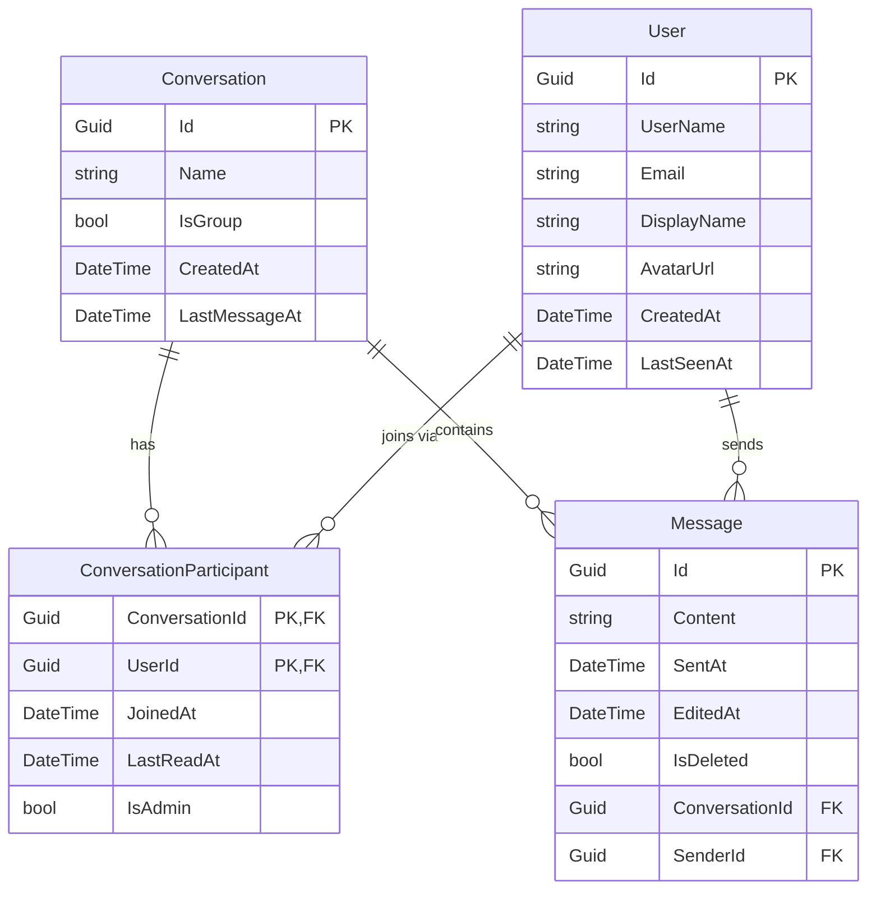

```mermaid
erDiagram
    User {
        Guid Id PK
        string UserName
        string Email
        string DisplayName
        string AvatarUrl
        DateTime CreatedAt
        DateTime LastSeenAt
    }

    Conversation {
        Guid Id PK
        string Name
        bool IsGroup
        DateTime CreatedAt
        DateTime LastMessageAt
    }

    ConversationParticipant {
        Guid ConversationId PK, FK
        Guid UserId PK, FK
        DateTime JoinedAt
        DateTime LastReadAt
        bool IsAdmin
    }

    Message {
        Guid Id PK
        string Content
        DateTime SentAt
        DateTime EditedAt
        bool IsDeleted
        Guid ConversationId FK
        Guid SenderId FK
    }

    Conversation ||--o{ ConversationParticipant : "has"
    User ||--o{ ConversationParticipant : "joins via"
    Conversation ||--o{ Message : "contains"
    User ||--o{ Message : "sends"
```
